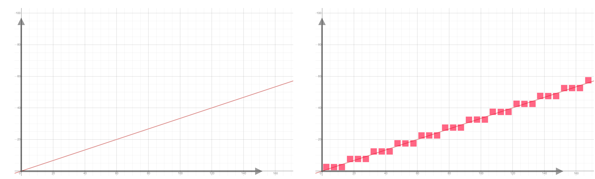

# Air-Hockey-Haskell

## Preview
<p align="center">
  
</p>

### Usage
Due to the dependency of the libraries, you may want to run the program in this [VM](https://drive.google.com/file/d/1225EjVN8goUe44aapiYOMfRd15aRtEBg/view?usp=sharing)

Steps of running this program :
1. ```git clone git@github.com:chl131/Air-Hockey-Haskell.git```
2. ```cd Air-Hockey-Haskell```
3. ```stack build```
4. ```stack run```

### Contributions
Project Members : Yuka Chu, Chi-Hsuan Lee, Yi-Ting Wang, Heidi Cheng

Original Repo : https://github.com/HeidiCheng/CSE230-FinalProject

### Rules
* Two-player ping pong game
* Control vertical position of two rackets with keyboard (`w` and `s` for Player 1; `up` and `down` for Player 2)
* One earns a point when the other player misses the ball
* The next ball is served towards the previous scored player
* The second ball is added after someone gets 3 points
* Game ends when one of the players hit a score of 5

### Features 
* Randomly generate ball's initial direction
* Ball reflects when hitting the rackets, ceiling, and floor
* Determine a player earns points when balls hit the opponent's sidewall 
* Enable two players to controls the rackets
* Add an extra ball to increase difficulty in the pong game


### Program Architecture
Libraries: [brick](https://hackage.haskell.org/package/brick), [vty](https://hackage.haskell.org/package/vty)
References: [ranjitjhala/brick-tac-toe](https://github.com/ranjitjhala/brick-tac-toe), [samtay/snake](https://github.com/samtay/snake)

```
src
 ├── Model 
 │   ├── Ball.hs
 │   ├── Player.hs
 │   └── Score.hs
 ├── Control.hs 
 ├── Main.hs
 ├── Model.hs
 ├── Types.hs
 └── View.hs
```
`Ball.hs` controls the movement of the ball.
`Player.hs` records the position of the rackets.
`Score.hs` is responsible for adding scores for players and determining if there is a winner.
`Control.hs` transforms states when there are keyboard interrupt, etc.
`Main.hs` contains the main function defined by the `brick` package.
`Model.hs` wraps up the interaction between files under the directory, `Model`.
`Types.hs` stores all of the data types we define.
`View.hs` creates the UI of the program.


### Difficulties and Solutions
1. Assemble each part of work from our group members and make it execute correctly
   - We designed clear APIs (data types) to let each group member commit individually without worrying about conflicts
2. To randomly serve balls, we had to deal with IO
   - We made the output of serving a ball a IO monad (Since generating a random number in Haskell is a IO)
3. We needed to deal with the movement of two balls separately and defined when to consider the second ball
   - In our PlayState, there are two objects: ball1 and ball2, each of them is a data - Ball.
   - We used an extra Boolean variable in PlayState to record whether the second ball is added to the game.

### Limitations
1. Due to the nature of pixel games, it is inevitable that the ball moves discretely
<p align="center">
  
</p>

2. Both players have to press and release the keyboard to move.
   (when two players press to move at the same time, one player gets stuck)
